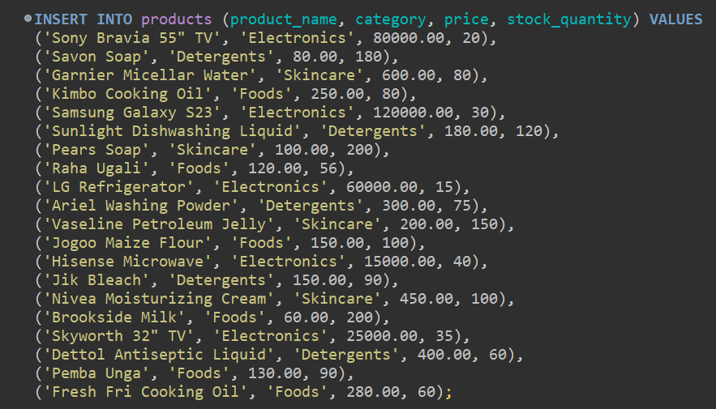
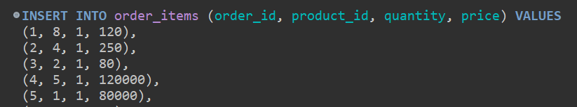
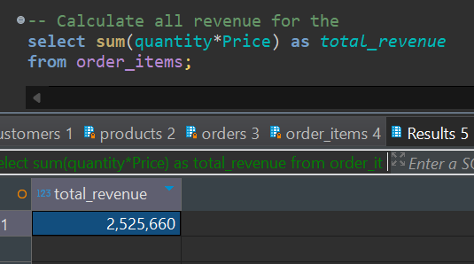

# Ecommerce platform database modeling and analysis in PostrgreSQL
This project demonstrates the application of SQL skills in joins,
aggregations and optimization to design and implement an efficient schema 
for an E-commerce platform. 

The following is further documentation on each task for submission

## Task 1: Database Design
The database contains for tables; `customers`, `products `, `orders` and `order_items`.
We establish a relationship between the `orders` and `customers` table through a
foreign key column `customer_id` in the `customers` table to the `customer_id` column in
the `orders` table. 
The `order_items` table contains product and  customer information for each made by 
customers. `order_id` and `product_id` columns in `order_item` link to the `order_id`
and `product_id` columns in `orders` and `products` tables. The ER diagram below provides 
a visual representation of the schema

## Task 2: Database Setup
To implement the schema in the database, 
we call `create table if not exists <table_name> (<col_1>,<col_2?>, ...)` for each table 
and the corresponding constraints and relationships in the columns. 

To persist data, 
we call `insert  into <table_name> (<col_1>, <col_2>, ...) values (<val_1, <val_2>, ...)` for each table.

## Task 3 - Analytical Queries
### Revenue Analysis
To calculate the total revenue by the platform we run the following query

To find the total revenue per product

### Customer Insights
To extract the top 5 customers by spending we run

To identify the customers who have not made a purchase 

### Product Trends
To find the 3 best selling product we run

To identify the products that have ran out of stock we call the following query.

### Order Details
To retrieve all items in a specific order we call 

To view the amount a given order call

### Monthly Trends
To calculate orders and revenue per month

## Task 4 - Advanced SQL Concepts
### Joins
To query data from multiple tables joins as follows

### Window functions
To rank customers based on total spending tun the following

To assign a unique number to each order for a customer run

### CTEs and Sub-queries
To calculate total revenue per customer and find customers spending
more than $500 proceed as follows

To find the product with the highest price use a sub-query as follows

## Indexing
Use `explain analyze` to demonstrate efficiency of adding index columns

## Optimization

Rewrite CTE to sub-query

 

